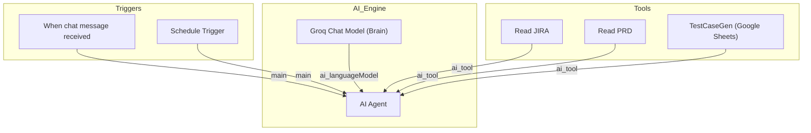

# n8n Workflow Diagram

This workflow automates the generation of test cases by integrating JIRA ticket data with PRD analysis using an AI Agent.

## Workflow Description
1. **When chat message received**: Triggered when a message is sent to the chat.
2. **Schedule Trigger**: Triggered at a scheduled interval.
3. **AI Agent**: The core logic that processes the input and generates test cases.
4. **Groq Chat Model (Brain)**: Provides the AI inference capabilities.
5. **Read JIRA**: Tool for retrieving JIRA ticket details.
6. **Read PRD**: Tool for reading Product Requirement Documents from Google Docs.
7. **TestCaseGen**: Tool for saving the generated test cases to Google Sheets.
